# Nechama Braun

## About Me
I’m a **Software Developer**, ambitious and goal-oriented.  
Passionate about learning new technologies, problem-solving, and building efficient, creative solutions.  
Strong foundation in computer science, quick self-learner, and a team player with excellent interpersonal skills.

---

## Featured Projects

### [Real Estate Appraisal Office Management System](https://github.com/neBraun/Assessors)
Full-stack system for managing appraisal cases, documents, and client communication.  
Role-based interfaces for admin, appraiser, and client, with secure authentication and clear permission levels.  
**Tech:** C# .NET Core (MVC), React (Redux, MUI), MS SQL Server  
➡️ [See full details below.](#real-estate-appraisal-office-system)

  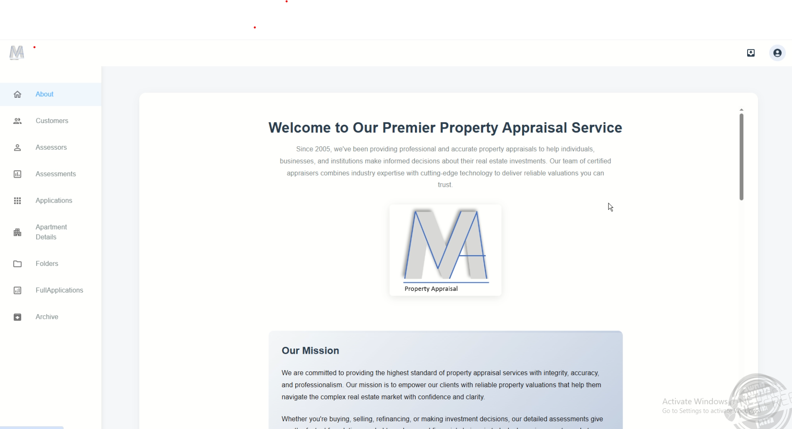
  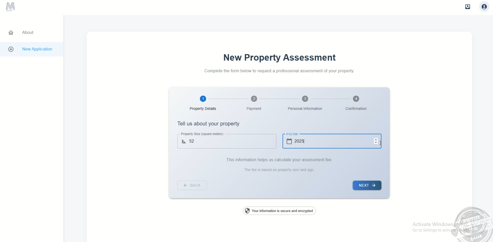
  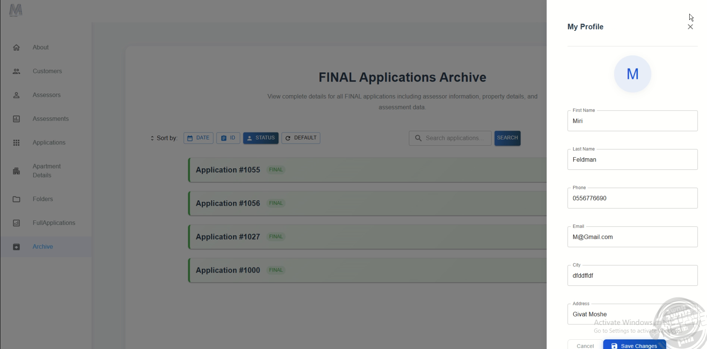
  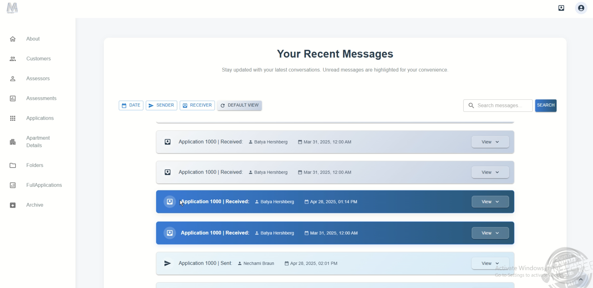
  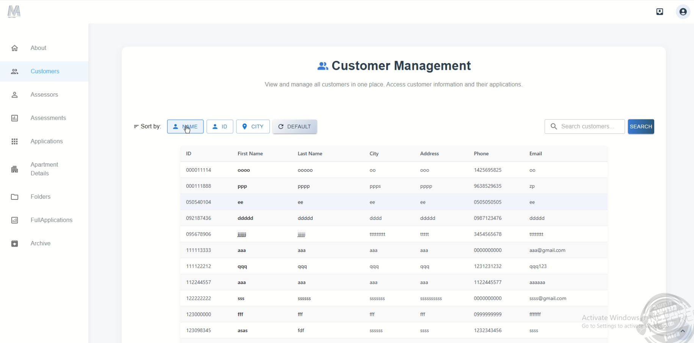
  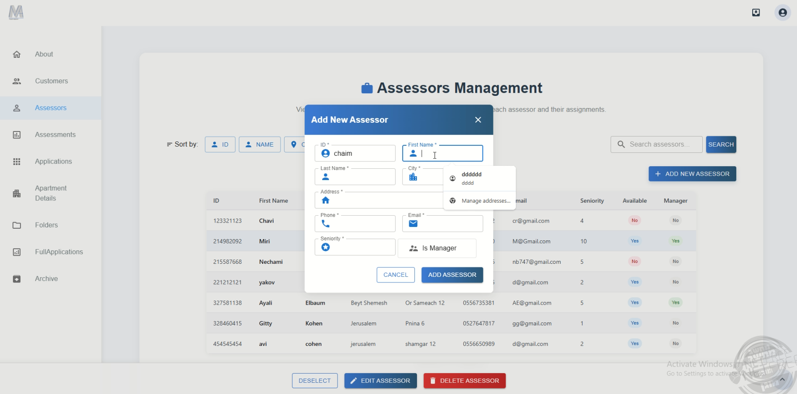

---

### [Shared Workspace Management System – Klika, Bnei Brak](https://github.com/neBraun/Clicka)
Full-stack platform for managing shared office spaces: user roles, bookings, contracts, payments, and analytics.  
Interactive map shows real-time occupancy and client allocation.  
**Tech:** Node.js, React, PostgreSQL, Google Calendar API  
➡️ [See full details below.](#shared-workspace-management-system)

  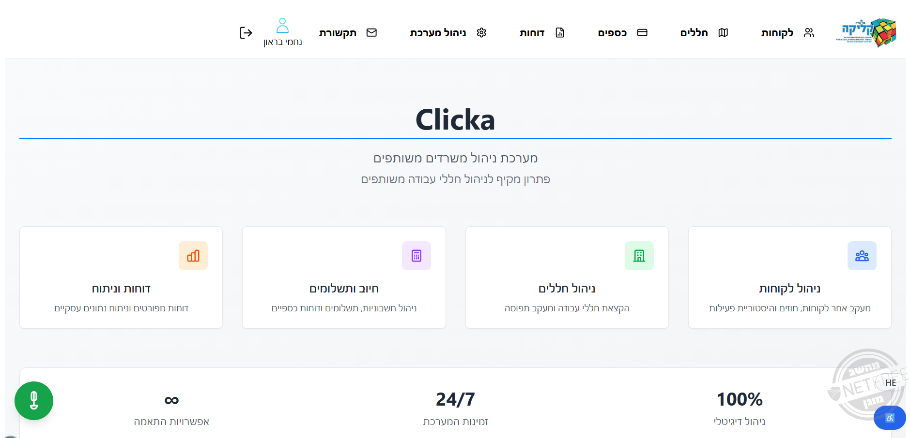
  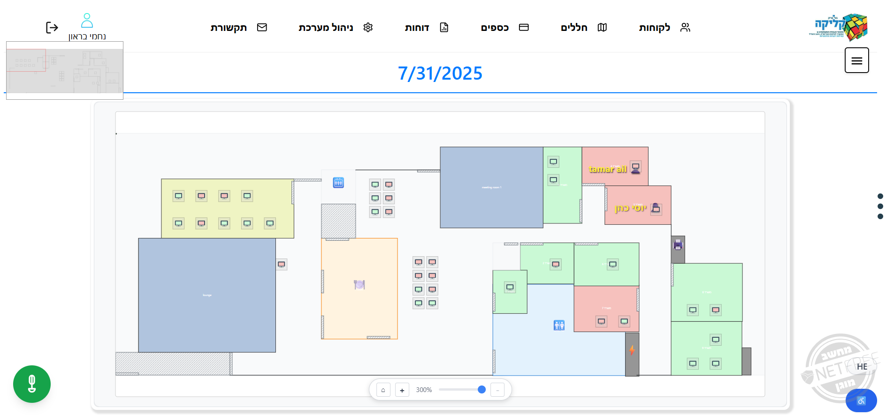
  
  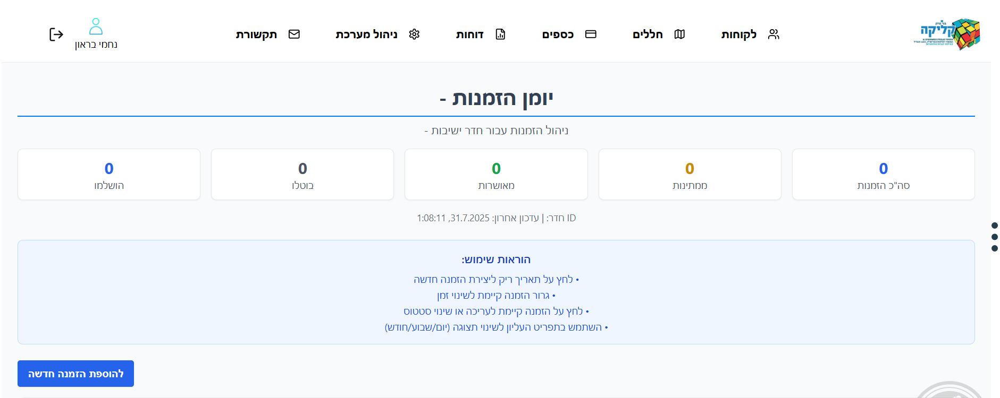
  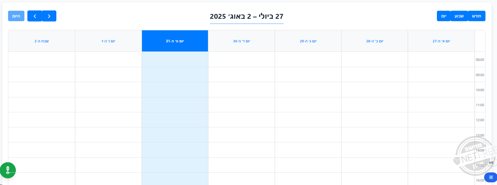
  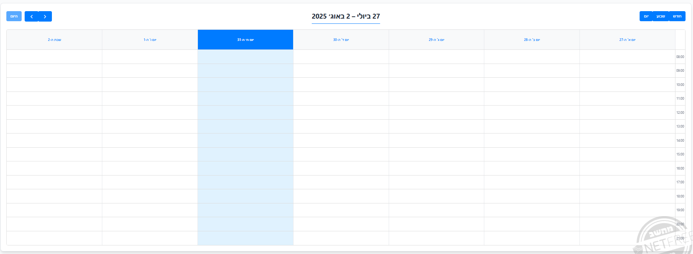

---

## 🛠 Tech Stack

| Category              | Technologies |
|-----------------------|--------------|
| **Programming**       | C, C++, Java, C#, Python |
| **Web Development**   | JavaScript, React, Angular, Node.js, .NET Core, WebAPI |
| **Databases**         | SQL, SQL Server, MongoDB |
| **Cloud & Tools**     | AWS, GitHub |
| **IDEs**              | Visual Studio, VS Code, PyCharm, Eclipse, NetBeans, IntelliJ |
| **Computer Science**  | Algorithms, Data Structures, Graph Theory |

### Visual Overview

<!-- Languages -->

<!-- Web -->

<!-- Cloud & Config -->

<!-- Databases -->

<!-- IDEs -->

---

## Contact
Email: **ny545185@gmail.com**

---

## Project Details

### Real Estate Appraisal Office System
Full-stack system for managing appraisal processes in a real estate office.  
Multiple role-based interfaces: Administrator, Appraiser, Client, and a Landing Page for new users.  

**Key Features:**
- Automatic case assignment, progress tracking, case archiving  
- Real-time chat & notifications between clients and appraisers  
- Upload, update, and organize client documents  
- Research tables for property evaluation  
- Approval workflow with manager notifications  
- Secure authentication and authorization  

**Stack:**  
Backend – C# .NET Core (MVC, Web API)  
Frontend – React (Redux, Hooks, MUI)  
Database – MS SQL Server  

---

### Shared Workspace Management System
Developed for Klika, Bnei Brak Municipality.  
Supports multi-level user management, booking, contracts, payments, and analytics.  

**Key Features:**
- Multi-role user management  
- Dynamic booking and billing  
- Secure payments & automated emails  
- Interactive map with real-time occupancy view  
- Two-way Google Calendar sync  
- WebSocket for live updates  

**Stack:**  
Backend – Node.js  
Frontend – React  
Database – PostgreSQL  
Integrations – Google Calendar API, WebSocket

---

Thank you for visiting my profile!  
I value clean code, teamwork, and continuous learning.  
Feel free to reach out or explore my repositories for more details and examples of my work.
