# Nechama Braun

## About Me

I am a **Full Stack Software Engineer** with end-to-end experience designing, building and delivering enterprise web applications.

I enjoy turning complex business processes into secure, scalable and intuitive software, combining software architecture, full-stack development and business thinking to create solutions that make a real impact.

As a high-honors software engineering graduate, I bring strong analytical thinking, fast learning and a hands-on approach to solving complex technical challenges.

---

## Featured Projects

### 🏆 Enterprise Management Platform | [Ezri Meim](https://github.com/neBraun/Ezri-Meim)

Architected and developed a centralized enterprise platform for managing complex organizational workflows, replacing fragmented manual processes with a unified system.

Designed a secure RBAC/RLS authorization architecture, scalable REST APIs, relational database structure and extensive business automation.

Led a team of 4 developers while making architectural decisions, coordinating development and integrating Google Workspace services and external APIs.

**Tech:** React, TypeScript, Node.js, Express, PostgreSQL, Supabase, Tailwind CSS

➡️ [View Repository](https://github.com/neBraun/Ezri-Meim)  
➡️ [See full details below.](#ezri-meim-enterprise-management-platform)

  <!-- Add Ezri Meim screenshots to pictures/ezri_meim/ -->
  
  
  

---

### 🏆 Full Stack Developer | [Shared Workspace System](https://github.com/neBraun/Clicka)

Developed as part of a **16-developer team** in an intensive project to build a full-stack management platform for Bnei Brak Municipality.

Contributed to backend services, REST APIs, database design, Google Calendar integration and real-time data synchronization.

**Tech:** Node.js, React, PostgreSQL, Google Calendar API, WebSocket

➡️ [View Repository](https://github.com/neBraun/Clicka)  
➡️ [See full details below.](#shared-workspace-management-system)

  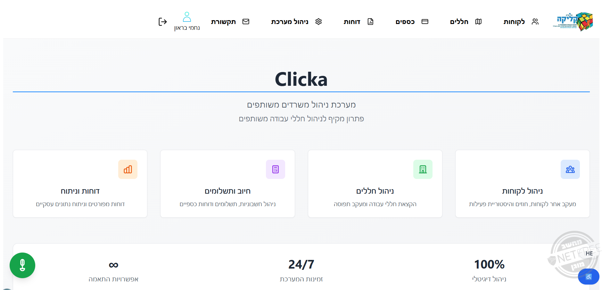
  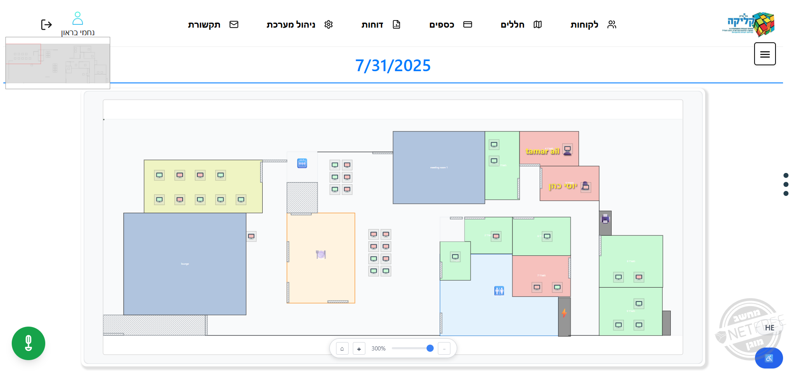
  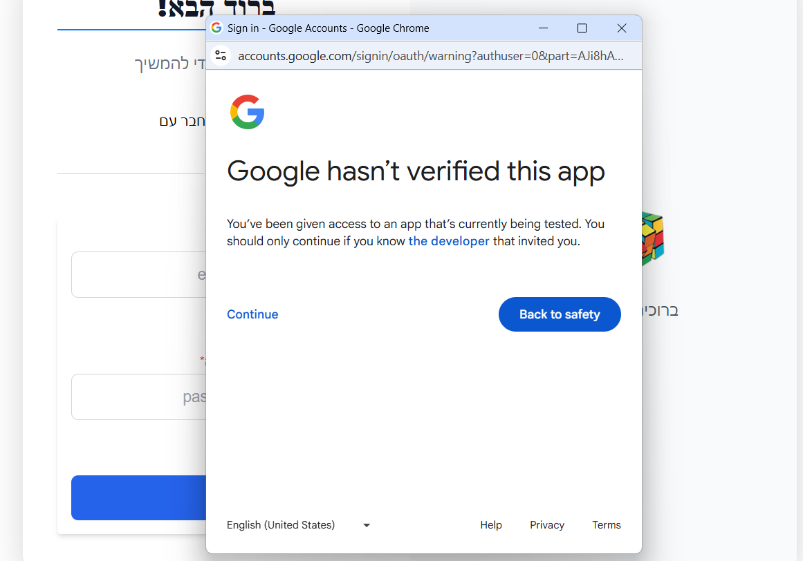
  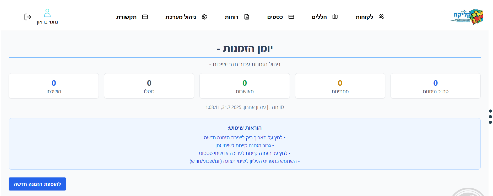
  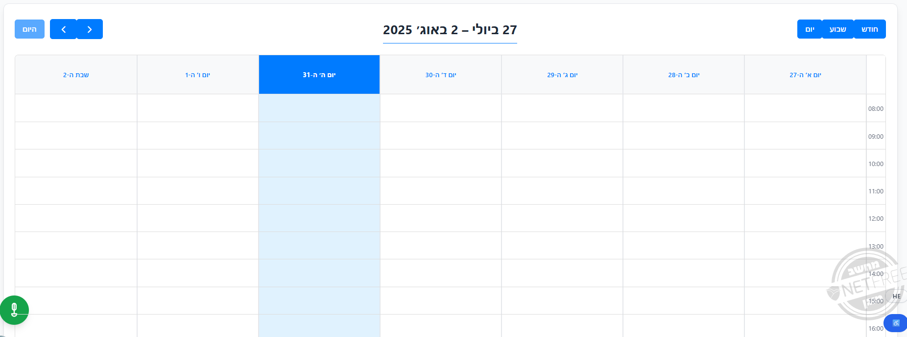
  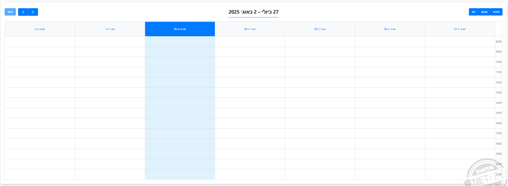

---

### Real Estate Appraisal Office Management System

Designed and developed a full-stack system for managing appraisal cases, documents and client communication.

Built the REST API, database architecture and React application, including role-based access, case tracking and internal communication.

**Tech:** C#, .NET Core, Entity Framework, React, Redux, MUI, MS SQL Server

➡️ [View Repository](https://github.com/neBraun/Assessors)  
➡️ [See full details below.](#real-estate-appraisal-office-system)

  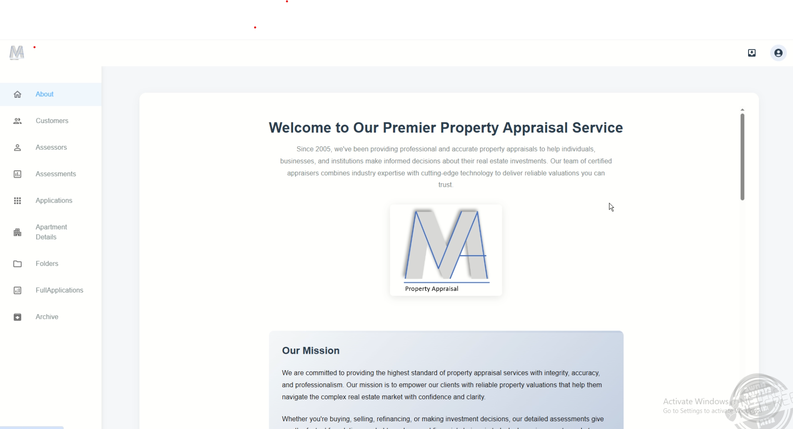
  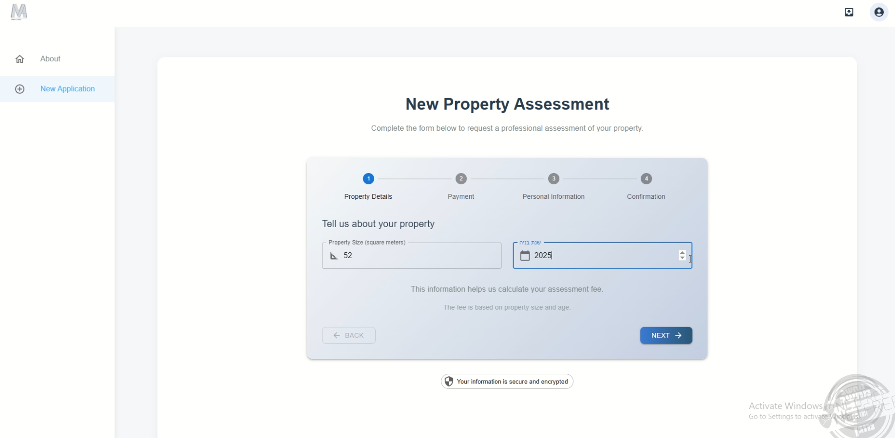
  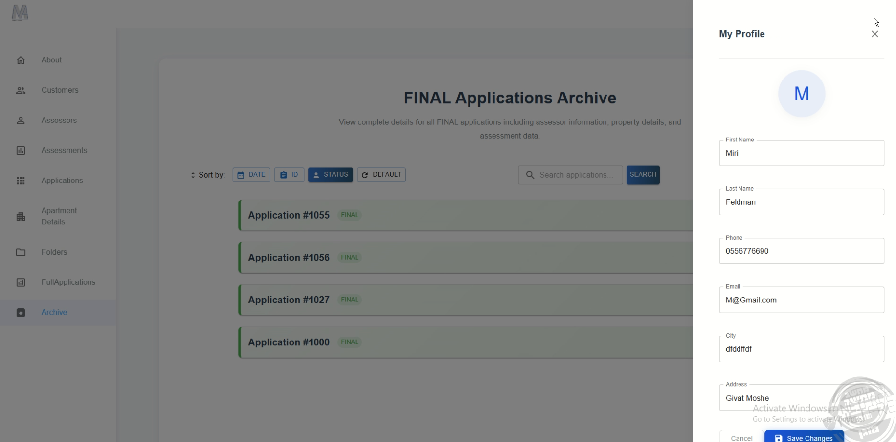
  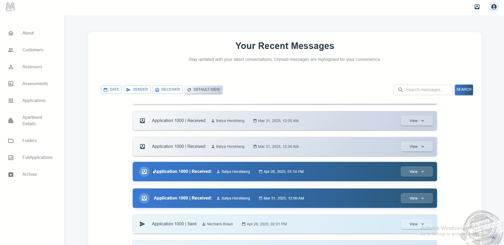
  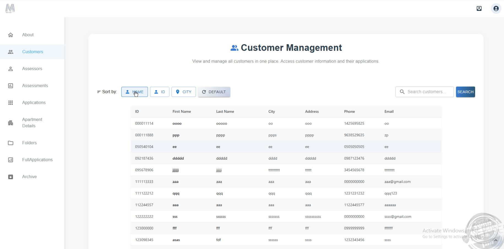
  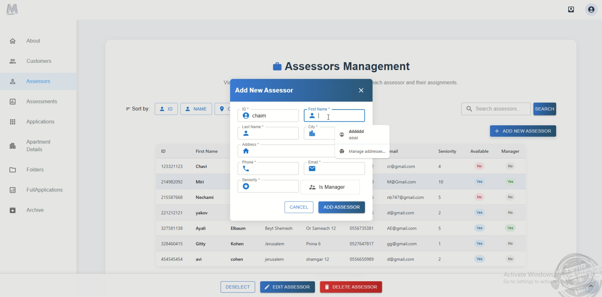

---

## 🛠 Tech Stack

### Languages & Frameworks

  
  
  
  
  
  
  
  
  
  
  

### Databases & Cloud

  
  
  
  
  

### Tools & Development

  
  
  
  
  

**Core:** Algorithms, Data Structures, OOP, Design Patterns, REST APIs, Database Design, Authentication & Authorization, Git, Cloud Deployment, AI-Assisted Development

---

## Contact

Email: **ny545185@gmail.com**
git: **https://github.com/neBraun/neBraun**
---

# Project Details

## Ezri Meim Enterprise Management Platform

A full-stack enterprise management platform designed to centralize and automate complex organizational workflows.

The system replaces fragmented spreadsheets, manual processes and disconnected files with a unified platform for managing patients, donors, employees, events, tasks, documents, surveys, communications and organizational operations.

### Key Features

- Centralized management of organizational workflows
- Role-Based Access Control (RBAC)
- Row-Level Security (RLS) at the database level
- Fine-grained permissions for entities and operations
- Automated business workflows and email notifications
- Patient and donor management
- Events and calendar management
- Task management with automated reminders
- Surveys, letters and document management
- Expense and income tracking
- Google Workspace integrations
- Google Calendar integration
- Google Drive integration
- Google Forms integration
- Google Forums integration
- External API integrations
- File management and document organization
- Export capabilities
- Responsive administrative dashboards

### Security Architecture

Designed and implemented the authorization architecture from the ground up using **RBAC + RLS**.

The system separates:

- Users
- Employees
- Roles
- Permissions
- Employee-role relationships
- Role-permission relationships

Database-level **Row-Level Security policies** validate every protected operation through permission checks before allowing access to data.

The frontend also dynamically adapts to the user's permissions, controlling accessible screens, tabs and actions.

This creates multiple layers of authorization between the user interface, application logic and database.

### My Role & Contributions

- **Architecture:** Designed the overall system architecture and technical approach.
- **Full-Stack Development:** Developed both backend and frontend components.
- **Team Leadership:** Led and coordinated a team of 4 developers, divided tasks and reviewed implementation.
- **Backend:** Developed Node.js/Express services and REST APIs.
- **Frontend:** Developed React + TypeScript interfaces using modern state-management and data-fetching patterns.
- **Database:** Designed PostgreSQL schemas, views, functions and security policies using Supabase.
- **Security:** Designed and implemented RBAC, RLS and permission-based access control.
- **Integrations:** Implemented integrations with Google Workspace services and external APIs.
- **Automation:** Designed automated workflows and notification processes to reduce manual organizational work.
- **Architecture Decisions:** Researched and selected technologies, patterns and architectural approaches according to project requirements.

**Tech:** React, TypeScript, Node.js, Express, PostgreSQL, Supabase, Tailwind CSS, Google APIs

---

## Shared Workspace Management System

Developed for **Klika, Bnei Brak Municipality** as part of an intensive 3-month project.

The platform provides centralized management of shared workspaces, bookings, contracts, payments and organizational operations.

### Key Features

- Multi-level user management
- Dynamic booking and billing
- Real-time data synchronization
- Google Calendar integration
- Secure Google OAuth authentication
- Interactive workspace map
- Administrative dashboard
- Analytics and reporting

### My Role & Contributions

- **Team Collaboration:** Worked within a 16-developer team, coordinating development activities and participating in code reviews.
- **Backend Development:** Developed backend logic and REST API services.
- **Frontend Development:** Contributed to the React-based application, including calendar and booking functionality.
- **Database:** Participated in PostgreSQL database design and complex queries.
- **Integration:** Implemented bidirectional communication with Google Calendar API.
- **Real-Time Features:** Worked with WebSocket-based synchronization.
- **Agile:** Worked with Sprints, task planning, Git and collaborative development workflows.
- **Mentoring:** Provided technical guidance and supported team members during development.

**Tech:** Node.js, React, PostgreSQL, Google Calendar API, WebSocket, Git

---

## Real Estate Appraisal Office System

A full-stack management system designed to manage appraisal cases, documents and communication between office staff, appraisers and clients.

### Key Features

- Role-based access control
- Multiple user roles
- Case tracking and status management
- Document management
- Client and appraiser management
- Internal communication
- Administrative dashboards
- Secure data management

### My Role & Contributions

- **Full-Stack Development:** Designed and developed the application end-to-end.
- **Backend:** Developed RESTful APIs using C# .NET Core and Entity Framework.
- **Database:** Designed and implemented the MS SQL Server database.
- **SQL:** Developed complex queries and stored procedures and worked on database performance optimization.
- **Frontend:** Developed the React application using Redux, Hooks and Material UI.
- **Architecture:** Implemented a layered 3-Tier architecture.
- **UI:** Built responsive, business-oriented interfaces with attention to pixel-perfect implementation.

**Tech:** C#, .NET Core, Entity Framework, Web API, React, Redux, MUI, MS SQL Server

---

## Other Projects

### Automated Lottery System

Developed an automated lottery management system using:

**Tech:** Node.js, Angular 19, MongoDB

---

## Education

**Software Engineering | 2023–2024**

High-honors graduate of the **Kamatech Code Ultra** software engineering program.

**Software Engineering Practical Engineer – מה"ט**  
Graduated with an average of **98**.

---

## Languages

**Hebrew:** Native  
**English:** Professional working proficiency

---

Thank you for visiting my profile!

I value clean architecture, continuous learning, effective teamwork and building software that solves real problems.
